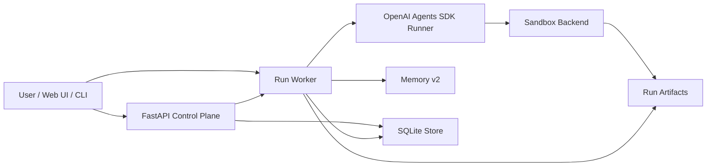

# Copilot Agent Platform

[](pyproject.toml)
[](https://github.com/openai/openai-agents-python)
[](#quality-gate)
[](#quality-gate)

一个基于 [OpenAI Agents SDK](https://github.com/openai/openai-agents-python) 的工程化 Copilot 平台原型。

目标不是再写一个简单聊天机器人，而是构建一个具备 **workspace sandbox、多模型路由、结构化 memory、run timeline、artifact 审计和 Web/API 控制平面** 的 agentic coding copilot。

> 当前项目仍是原型阶段，适合学习、实验和展示 agent 平台工程能力。不要直接作为多租户生产系统使用。

## Highlights

| 能力 | 当前状态 |
| --- | --- |
| OpenAI Agents SDK runtime | 使用 `Runner`、`SandboxAgent`、SDK sandbox client 作为核心执行层 |
| 多模型路由 | 支持 OpenAI 原生模型和 DeepSeek 等 OpenAI-compatible Chat Completions provider |
| Workspace sandbox | 支持 `unix_local` 和 Docker sandbox backend |
| Docker hardening | 支持项目镜像、网络策略、CPU/内存限制、命令超时和真实 Docker smoke test |
| Memory v2 | `.copilot/memory.json` 结构化存储，`.copilot/memory.md` 人类可读索引 |
| Tool policy + approvals | shell、apply_patch、git、network 统一策略分类，高风险操作进入审批 |
| Web/API 控制平面 | FastAPI + 轻量 Web UI，可创建 project/run、查看 timeline/artifacts/diff |
| 审计闭环 | 每次 run 保存 final output、diff、verification log、runtime log 和 artifact metadata |
| 测试质量 | 单元测试、集成测试和覆盖率门槛保持在 95% 以上 |

## Architecture



平台层负责工程能力：project/run 管理、模型配置、sandbox policy、memory、artifact、API 和 UI。

Agents SDK 负责 agent runtime：模型调用、tool loop、sandbox agent 和 sandbox client 生命周期。

## Repository Layout

```text
.
├── docs/                    # 产品需求、架构、阶段设计和实现笔记
├── examples/sample_repo/     # 最小样例仓库，用于闭环验证
├── docker/                   # Copilot sandbox 项目镜像
├── scripts/                  # smoke test / 工具脚本
├── src/copilot_agent/        # CLI、API、worker、memory、sandbox backend
└── tests/                    # 单元测试与集成测试
```

## Quick Start

```bash
python3 -m venv .venv
source .venv/bin/activate
python -m pip install -e '.[dev,docker]'
cp .env.example .env
```

配置一个模型 provider。低成本开发可以先用 DeepSeek：

```env
COPILOT_MODEL_PROVIDER=deepseek
DEEPSEEK_MODEL=deepseek-v4-flash
DEEPSEEK_API_KEY=<your-deepseek-api-key>
```

也可以使用 OpenAI 原生模型：

```env
COPILOT_MODEL_PROVIDER=openai
OPENAI_MODEL=gpt-4.1-mini
OPENAI_API_KEY=<your-openai-api-key>
```

`.env` 已被 `.gitignore` 忽略，不会提交到仓库。

## CLI Demo

初始化样例项目：

```bash
copilot-agent init --repo examples/sample_repo
```

运行一次 coding copilot 任务：

```bash
copilot-agent run \
  --repo examples/sample_repo \
  --task "Inspect the sample repo and run tests. Do not modify code unless tests fail." \
  --test-cmd "python -m pytest tests" \
  --provider deepseek \
  --memory \
  --host-verify
```

查看和应用 sandbox diff：

```bash
copilot-agent runs
copilot-agent show-run --run run_YYYYMMDD_HHMMSS_xxxxxx --diff --final
copilot-agent apply-run --run run_YYYYMMDD_HHMMSS_xxxxxx --check
copilot-agent apply-run --run run_YYYYMMDD_HHMMSS_xxxxxx
```

`apply-run` 会先执行 `git apply --check`。只有 patch 能干净应用时，才会写回真实仓库。

## Docker Sandbox

构建项目专用 sandbox 镜像：

```bash
docker build -t copilot-agent-python:latest -f docker/copilot-python.Dockerfile .
```

使用 Docker backend 运行：

```bash
copilot-agent run \
  --repo examples/sample_repo \
  --task "Inspect the sample repo and run tests." \
  --test-cmd "python -m pytest tests" \
  --provider deepseek \
  --sandbox-backend docker \
  --docker-image copilot-agent-python:latest \
  --docker-network none \
  --docker-memory-limit 1g \
  --docker-cpus 2
```

真实 Docker smoke test：

```bash
COPILOT_RUN_DOCKER_SMOKE=1 \
COPILOT_DOCKER_IMAGE=copilot-agent-python:latest \
COPILOT_DOCKER_NETWORK=none \
COPILOT_DOCKER_MEMORY_LIMIT=1g \
COPILOT_DOCKER_CPUS=2 \
COPILOT_DOCKER_SMOKE_COMMAND="python -m pytest tests" \
python -m pytest tests/test_docker_smoke.py
```

详细说明见 [Phase 3 Docker Sandbox Backend](docs/22-phase-three-docker-sandbox-backend.md)。

## Local API And Web UI

启动 API：

```bash
PYTHONPATH=src .venv/bin/uvicorn copilot_agent.api.main:app --reload
```

入口：

- Web UI: `http://127.0.0.1:8000/`
- API docs: `http://127.0.0.1:8000/docs`
- Runtime config: `http://127.0.0.1:8000/api/v1/runtime/config`

自动执行 queued run 的 `.env` 示例：

```env
COPILOT_API_AUTO_START_WORKER=true
COPILOT_WORKER_TEST_CMD=python -m pytest tests
COPILOT_WORKER_MEMORY_ENABLED=true
COPILOT_WORKER_HOST_VERIFY=true
COPILOT_DOCKER_IMAGE=copilot-agent-python:latest
COPILOT_DOCKER_NETWORK=none
COPILOT_DOCKER_MEMORY_LIMIT=1g
COPILOT_DOCKER_CPUS=2
COPILOT_SANDBOX_COMMAND_TIMEOUT_SECONDS=120
```

常用 API：

```bash
curl http://127.0.0.1:8000/api/v1/worker/status
curl http://127.0.0.1:8000/api/v1/policy/rules
curl http://127.0.0.1:8000/api/v1/runs/<run_id>/events
curl http://127.0.0.1:8000/api/v1/runs/<run_id>/artifacts
curl http://127.0.0.1:8000/api/v1/runs/<run_id>/diff
```

## Memory v2

Memory v2 借鉴了 Claude Code 的 memory 机制，但做成本项目当前阶段更适合的轻量文件实现：

```text
.copilot/
  memory.json    # 结构化 source of truth
  memory.md      # 人类可读索引和兼容入口
```

当前支持：

- `project_facts`: 项目事实、背景、约束。
- `code_preferences`: 代码和协作偏好。
- `run_history`: 历史 run 摘要、改动文件、验证结果。
- `conflicts`: 同标题 memory 内容变化时保留 old -> new 链路。
- `compacted_run_summary`: 超过保留上限的 run history 会被压缩。

Memory 读入不是全量注入，而是按当前 task 检索相关 project facts 和 code preferences。当前 repository 文件永远优先于 memory。

设计说明见 [Memory v2: Claude Code Inspired Design](docs/23-memory-v2-claude-code-inspired.md)。

## Quality Gate

当前本地验证命令：

```bash
.venv/bin/python -m ruff check src tests scripts
.venv/bin/python -m pytest tests --cov=src/copilot_agent --cov-report=term-missing
```

最近一次 Phase 4A 验证结果：

```text
97 passed
Total coverage: 96.31%
```

## Documentation

推荐阅读：

- [Product Requirements](docs/01-product-requirements.md)
- [System Architecture](docs/02-system-architecture.md)
- [Workspace Sandbox](docs/03-workspace-sandbox.md)
- [Memory Management](docs/04-memory-management.md)
- [Model Provider Env Design](docs/12-model-provider-env-design.md)
- [Phase 2 API AI Run](docs/19-phase-two-api-ai-run.md)
- [Phase 2 Web UI and Sandbox Backends](docs/20-phase-two-web-ui-sandbox-backends.md)
- [Phase 3 Sandbox Backend Protocol](docs/21-phase-three-sandbox-backend-protocol.md)
- [Phase 3 Docker Sandbox Backend](docs/22-phase-three-docker-sandbox-backend.md)
- [Memory v2](docs/23-memory-v2-claude-code-inspired.md)
- [Tool Policy and Approvals](docs/24-phase-four-tool-policy-approvals.md)
- [OpenAI Agents SDK Reading Notes](docs/09-openai-agents-reading-notes.md)

完整文档索引见 [docs/README.md](docs/README.md)。

## Roadmap

- Memory Curator: 自动从 run summary 中抽取 project facts 和 code preferences。
- Approval Policy: 高风险工具调用审批、策略记录和 UI review。
- Rich Web UI: run detail、artifact preview、memory viewer/editor。
- Provider Matrix: 更完整的 OpenAI、DeepSeek、Qwen、Volcano 等 provider 能力矩阵。
- Production Sandbox: 更严格的资源配额、网络策略、依赖缓存和 CI smoke job。

## Notes

`openai-agents-python/` 和 `cc-haha-main/` 是本地阅读参考源码时使用的可选目录，不提交到本仓库。

如果你想阅读上游 SDK，可以单独 clone：

```bash
git clone https://github.com/openai/openai-agents-python
```
