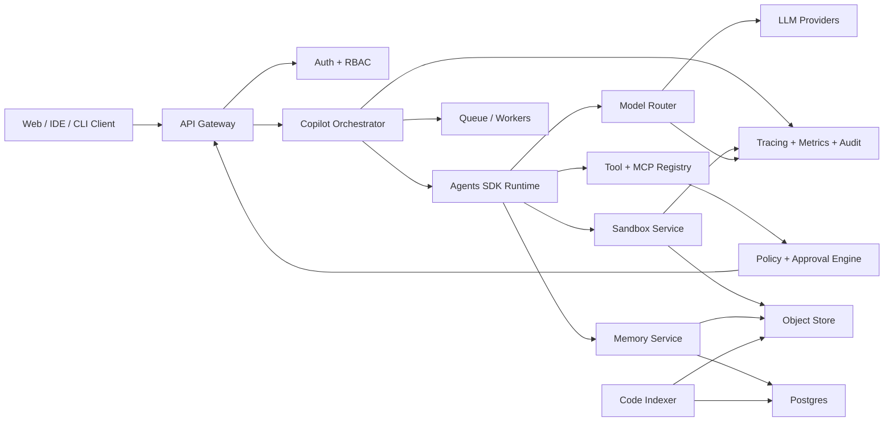
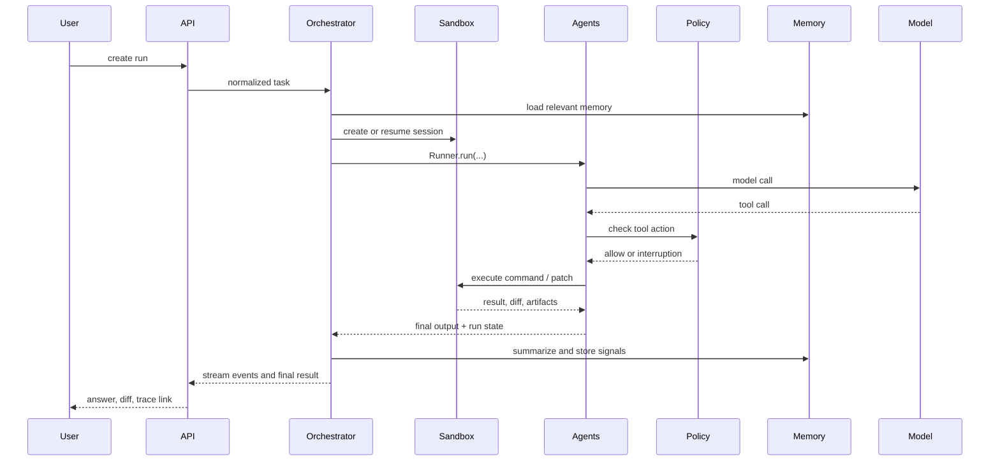

# 系统架构设计

## 架构目标

平台架构要把 agent 能力、workspace 执行、memory、模型路由和安全治理拆开。OpenAI Agents SDK 作为 agent runtime 和 orchestration 层，平台负责多租户、沙箱生命周期、持久化、策略、审计、UI 和部署。

## 总体架构

## 核心服务

| 服务 | 职责 |
| --- | --- |
| API Gateway | 对外 REST/WebSocket API，鉴权，限流，请求归一化 |
| Auth + RBAC | 租户、用户、项目、角色、资源权限 |
| Copilot Orchestrator | 创建 run，选择 workflow，恢复 run state，协调 agent 和 sandbox |
| Agents SDK Runtime | 基于 `Agent`、`SandboxAgent`、`Runner` 执行多 agent 任务 |
| Model Router | 解析 model profile，选择 provider，fallback，成本记录 |
| Tool + MCP Registry | 注册 function tools、MCP servers、hosted tools、sandbox tools |
| Policy + Approval Engine | 对 tool call、命令、文件、网络、模型路由做策略判断 |
| Sandbox Service | 创建、恢复、关闭 sandbox session，管理 manifest、snapshot、artifact |
| Memory Service | 管理 session memory、project memory、user preference、memory extraction |
| Code Indexer | 代码结构索引、embedding、符号检索、依赖图 |
| Observability | trace、metrics、audit log、run replay、cost dashboard |

## Agent 拆分

| Agent | 角色 | 默认工具 | 默认模型 |
| --- | --- | --- | --- |
| Triage Agent | 判断任务类型、风险、所需上下文 | metadata、memory search | 快速低成本模型 |
| Planner Agent | 生成计划和验收标准 | repo map、memory、issue context | 中高能力模型 |
| Workspace Explorer | 读取代码、搜索依赖、总结结构 | filesystem、ripgrep、index search | 中等模型 |
| Coder Agent | 修改文件、生成 patch | apply_patch、shell、test | 高能力代码模型 |
| Reviewer Agent | 审查 diff、风险、测试覆盖 | diff、shell read-only、policy | 高能力推理模型 |
| Test Runner | 执行测试和诊断失败 | shell、logs、artifacts | 中等模型 |
| Memory Curator | 提取长期经验并更新 memory | memory files、redaction | 低成本模型加规则 |

## 任务生命周期

## SDK 集成方式

### 普通 agent

适合无需文件系统的任务，例如需求澄清、计划、总结、memory extraction、模型路由诊断。

使用方式：

- `Agent` 定义角色、instructions、tools、handoffs。
- `Runner.run` 执行。
- `Session` 存储会话历史。
- `RunConfig` 注入 model、model_provider、workflow_name、group_id。

### Sandbox agent

适合需要真实 workspace 的任务，例如代码修复、测试、文档生成、文件分析。

使用方式：

- `SandboxAgent` 定义 agent 和 sandbox defaults。
- `Manifest` 定义 fresh workspace 内容。
- `SandboxRunConfig` 定义 client、session、snapshot、manifest override。
- `Filesystem`、`Shell`、`Memory`、`Compaction` 等 capabilities 控制沙箱能力。

## 部署形态

| 阶段 | Sandbox backend | 数据层 | 适用 |
| --- | --- | --- | --- |
| 本地开发 | `UnixLocalSandboxClient` | SQLite + local snapshots | 快速验证 |
| 团队测试 | Docker sandbox | Postgres + S3-compatible object store | 基本隔离 |
| 生产 | Hosted sandbox or Kubernetes worker | Postgres + Redis + object store + vector DB | 多租户和资源治理 |

## 关键边界

- Agents SDK 不负责完整 SaaS 平台治理，平台必须自己做 auth、RBAC、policy、billing、audit。
- Sandbox 是执行边界，不是业务权限边界。业务权限必须在平台层判断。
- Memory 是辅助上下文，不是事实数据库。当前 repo 和当前用户输入优先。
- 非 OpenAI provider 能力不一致，必须由 Model Router 做 capability validation。

