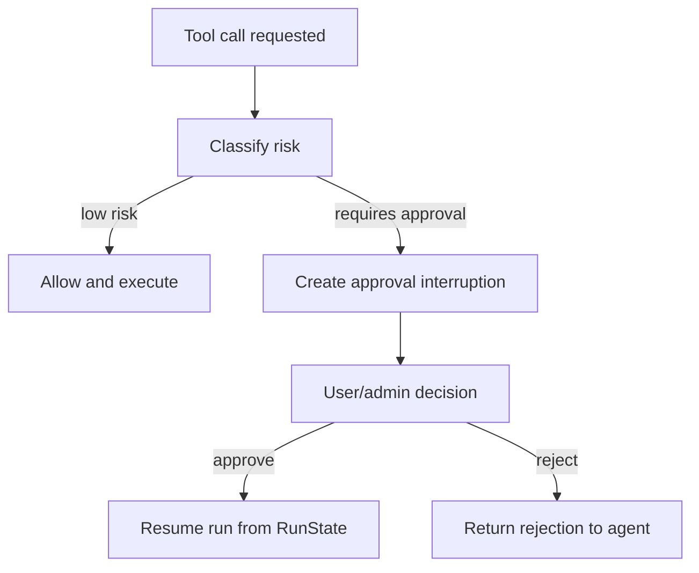

# Workspace 沙箱设计

## 设计原则

Workspace 沙箱是本产品的核心安全边界和执行边界。Agent 不能直接操作宿主机文件系统，而是通过平台创建的 sandbox session 读取文件、运行命令、应用 patch、生成 artifact。

核心原则：

- 默认隔离，默认最小权限。
- 每个 run 有明确 workspace root。
- 输入默认只读，输出显式可写。
- 高风险动作先审批。
- 所有命令、patch、文件访问、artifact 都进入审计。
- 沙箱状态可以快照、恢复、销毁。

## 概念模型

| 概念 | 定义 |
| --- | --- |
| Project | 用户或团队下的长期项目，绑定 repo、配置、memory、权限 |
| Workspace | 某次任务可见的文件集合，可以来自 repo、上传文件、远程对象存储 |
| Sandbox Session | 真实执行环境，拥有文件系统、进程、环境变量、资源限制 |
| Manifest | fresh sandbox session 的初始文件系统声明 |
| Snapshot | workspace 内容的持久化检查点 |
| Run State | agent runtime 的可恢复状态，包括 pending approvals |
| Artifact | 任务产生的报告、patch、日志、构建产物、截图等 |

## Sandbox backend 策略

| Backend | 用途 | 风险 |
| --- | --- | --- |
| Unix local | 本地开发最快，调试 SDK 行为 | 隔离弱，不适合作为多租户生产默认 |
| Docker | 团队测试和早期生产，镜像可控 | 需要容器逃逸防护、资源限制和 egress 策略 |
| Hosted provider | 生产多租户，平台托管执行环境 | 成本、冷启动、provider lock-in |
| Kubernetes worker | 自建生产环境 | 运维复杂，需要完善安全基线 |

推荐路径：

1. PoC 使用 Unix local。
2. MVP 使用 Docker sandbox。
3. Beta 引入 hosted sandbox 或 Kubernetes worker。
4. Enterprise 支持私有部署和客户自有 sandbox backend。

## Workspace materialization

Fresh sandbox 创建时，平台根据 task spec 和权限生成 manifest。

输入来源：

| 输入 | 默认权限 | 说明 |
| --- | --- | --- |
| Git repo | 可读写副本 | 写入只发生在 sandbox 副本，最终通过 diff 导出 |
| Uploaded files | 只读 | 除非用户明确允许生成派生文件 |
| Remote object storage | 只读 mount | 写回需要单独审批 |
| Project memory | 只读注入 | memory 写入走 Memory Service |
| Task files | 只读 | 包含 issue、要求、验收标准 |
| Output directory | 可写 | 生成报告、patch、artifact |

## 文件系统权限

推荐目录布局：

```text
workspace/
├── repo/                # task repo copy, controlled writable area
├── input/               # user supplied read-only files
├── task/                # task spec and policy hints
├── memories/            # sandbox memory, policy controlled
├── output/              # final artifacts
└── scratch/             # temporary work area
```

权限策略：

- `input/` 默认只读。
- `task/` 默认只读。
- `repo/` 可写，但最终只允许导出 diff。
- `output/` 可写。
- `scratch/` 可写，可在 run 结束时清理。
- `memories/` 默认由 Memory capability 管理，不允许任意 agent 直接写长期 memory。
- 任何 host absolute path grant 都必须来自受信任配置，不能来自模型输出。

## 命令执行策略

命令风险分级：

| 等级 | 示例 | 默认策略 |
| --- | --- | --- |
| R0 只读 | `ls`, `pwd`, `rg`, `sed`, `cat` | 自动允许，记录审计 |
| R1 构建测试 | `pytest`, `npm test`, `ruff check` | 自动允许或按项目策略允许 |
| R2 安装依赖 | `pip install`, `npm install`, `uv sync` | 需要审批或缓存环境 |
| R3 网络访问 | `curl`, `git clone`, package registry | 默认审批，受 egress allowlist 控制 |
| R4 破坏性操作 | `rm -rf`, reset, force push | 默认拒绝，特殊审批 |
| R5 外部发布 | push、deploy、发邮件、改 issue | 强审批，可能要求双人审批 |

## Patch 策略

- Agent 只能通过受控 patch tool 修改文件。
- Patch 路径必须相对 workspace root。
- Patch 前后记录 file checksum。
- 每次 patch 生成 diff event。
- 对 generated lockfile、大文件、二进制文件设单独策略。
- Patch 完成后由 reviewer agent 或规则引擎检查。

## 审批流程



## Snapshot 与恢复

需要持久化的状态：

| 状态 | 存储 | 用途 |
| --- | --- | --- |
| RunState | Postgres / object store | approval 后恢复 agent run |
| Sandbox session state | Postgres / encrypted blob | reconnect 到已有 session |
| Workspace snapshot | object store | 从文件系统检查点继续 |
| Artifact | object store | 用户下载和审计 |
| Diff | Postgres + object store | review、回滚、PR |

恢复策略：

- 短暂停顿使用 live sandbox session。
- 审批暂停使用 RunState。
- 进程重启使用 session_state。
- 长期暂停使用 snapshot。
- 跨 provider 或版本变化时重新 materialize fresh sandbox，再应用 patch/diff。

## 资源治理

| 资源 | MVP 默认 |
| --- | --- |
| CPU | per run quota |
| 内存 | per sandbox limit |
| 磁盘 | workspace size limit |
| 命令超时 | command-level timeout |
| Run 超时 | workflow-level timeout |
| 网络 | default deny, allowlist by project |
| 并发 | tenant/project/user/run limits |

## MVP 实现建议

- 使用 Docker sandbox 作为主要隔离层，Unix local 只用于开发。
- 每个 run 创建 fresh sandbox，后续再做 developer-owned live session 复用。
- 只开放 `Filesystem`、`Shell`、`Compaction`，memory 能力先按项目开启。
- 命令执行先实现 allowlist + denylist + approval。
- Snapshot 使用本地目录或 S3-compatible object store。
- 第一版只支持 repo copy，不支持写回远程 mount。

