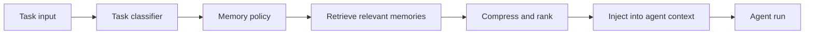

# Memory 管理设计

## 设计目标

Memory 系统要让 Copilot 在长期使用中变得更懂项目和用户，但不能牺牲安全、可控性和事实准确性。

核心目标：

- 保留有用上下文，减少重复探索。
- 按 tenant、project、repo、user、agent 隔离。
- 支持可编辑、可删除、可追溯。
- 默认不记忆密钥、PII、敏感文件、未经授权内容。
- 当前 workspace 和用户输入优先于 memory。
- Memory 写入必须可审计。

## Memory 分层

| 层级 | 生命周期 | 内容 | 存储 |
| --- | --- | --- | --- |
| Turn context | 单次模型调用 | 当前 prompt、tool result、临时 reasoning 输入 | 不长期存储或 trace 脱敏存储 |
| Session memory | 单个 conversation | 多轮对话历史、tool calls、assistant replies | SQLite/Postgres/Redis/OpenAI conversation |
| Run summary | 单个 run | 任务目标、改动、验证、失败、artifact | Postgres + object store |
| Sandbox memory | workspace snapshot 相关 | `memories/MEMORY.md`、rollout summaries | sandbox snapshot/object store |
| Project memory | 项目长期 | 架构约束、测试命令、代码规范、常见坑 | Postgres + vector DB + object store |
| User memory | 用户偏好 | 语言、输出风格、常用模型、审批偏好 | Postgres |
| Team memory | 团队规范 | PR 规范、安全策略、命名约定 | Postgres |
| Code memory | 代码索引 | symbols、dependencies、embeddings、file summaries | vector DB + search index |

## Memory 读路径



读路径规则：

- 先判断任务类型和 repo。
- 只检索同 tenant、同 project 或显式共享范围的 memory。
- 按权限过滤 memory。
- 检索结果需要带来源、时间、confidence。
- 注入上下文前做压缩和去重。
- 对陈旧 memory 加提示，要求 agent 以当前文件为准。

## Memory 写路径

```mermaid
flowchart LR
    Run["Completed run"]
    Extract["Extract candidate memories"]
    Redact["Redact secrets and PII"]
    Classify["Classify scope and type"]
    Review["Policy or human review"]
    Consolidate["Consolidate"]
    Store["Store with lineage"]

    Run --> Extract
    Extract --> Redact
    Redact --> Classify
    Classify --> Review
    Review --> Consolidate
    Consolidate --> Store
```



候选 memory 类型：

| 类型 | 示例 |
| --- | --- |
| Project fact | “后端入口在 `src/server.py`” |
| Workflow hint | “运行 Python 测试使用 `uv run pytest`” |
| Constraint | “不要修改 public API，除非 ADR 批准” |
| User preference | “用户偏好中文总结和英文 commit message” |
| Failure lesson | “`npm test` 需要先生成 prisma client” |
| Decision | “该项目选择 Postgres 而不是 MongoDB” |

禁止写入：

- API key、token、cookie、private key。
- 未脱敏的个人身份信息。
- 生产数据库内容。
- 客户机密文件原文。
- 模型未经验证的猜测。
- 与当前 workspace 冲突且没有标记来源的事实。

## Session memory

Agents SDK sessions 可以自动维护多轮 conversation history。平台建议：

- 本地开发使用 SQLite。
- 多 worker 部署使用 Redis 或 Postgres/SQLAlchemy。
- 长对话启用 history limit 和 compaction。
- 审批恢复时必须传入同一个 session 或同一 backing store。

Session 配置建议：

| 场景 | 策略 |
| --- | --- |
| 普通聊天 | 最近 N 条 + summary |
| 长任务 | session + RunState + snapshot |
| 审批暂停 | session ID 固定，RunState 持久化 |
| 高隐私任务 | store=false 或短 TTL session |

## Project memory schema

建议数据结构：

```json
{
  "id": "mem_123",
  "tenant_id": "tenant_1",
  "project_id": "proj_1",
  "repo_id": "repo_1",
  "scope": "project",
  "type": "workflow_hint",
  "title": "Test command",
  "content": "Run backend tests with `uv run pytest tests/backend`.",
  "source_run_id": "run_123",
  "source_artifact_ids": ["artifact_1"],
  "confidence": 0.82,
  "status": "active",
  "created_by": "memory_curator",
  "created_at": "2026-05-21T00:00:00Z",
  "expires_at": null,
  "tags": ["tests", "python"]
}
```

## Memory 冲突处理

冲突类型：

| 冲突 | 处理 |
| --- | --- |
| 新旧测试命令不同 | 保留两条，按最近验证时间排序 |
| 用户偏好改变 | 新偏好覆盖旧偏好，但保留历史 |
| 架构事实与当前代码冲突 | 标记 stale，要求 Memory Curator 更新 |
| 不同分支差异 | memory 绑定 branch 或 commit range |

## Context budget 管理

上下文注入优先级：

1. 当前用户任务。
2. 当前 workspace 文件和 diff。
3. 必要 tool results。
4. 最近 session history。
5. 高置信 project memory。
6. user preference。
7. team policy。
8. 低置信或陈旧 memory。

压缩策略：

- Session history 使用 turn-level trimming。
- Run summaries 使用 task-based summarization。
- Code memory 使用符号索引和文件摘要。
- Sandbox memory 使用 `memory_summary.md` 先注入，再按需读取详细 rollout summary。
- 超长 context 使用 retrieval 而不是全量塞入 prompt。

## Memory 治理

必须提供：

- memory 查看页面。
- memory 编辑和删除。
- memory 来源追踪。
- memory 禁用开关。
- project/user/team memory 分别导出。
- retention policy。
- sensitive memory scanner。
- stale memory detector。

## MVP 方案

- 使用 Agents SDK `SQLiteSession` 或 `SQLAlchemySession` 管理短期会话。
- 每个 run 结束生成 run summary。
- 每个 project 保存 `PROJECT_MEMORY.md` 风格的结构化 memory。
- 实现一个 Memory Curator agent，但写入前先走规则过滤。
- Memory 读入只注入 top K 条高置信结果。
- 先不自动记忆用户隐私偏好，改为显式确认后写入。

